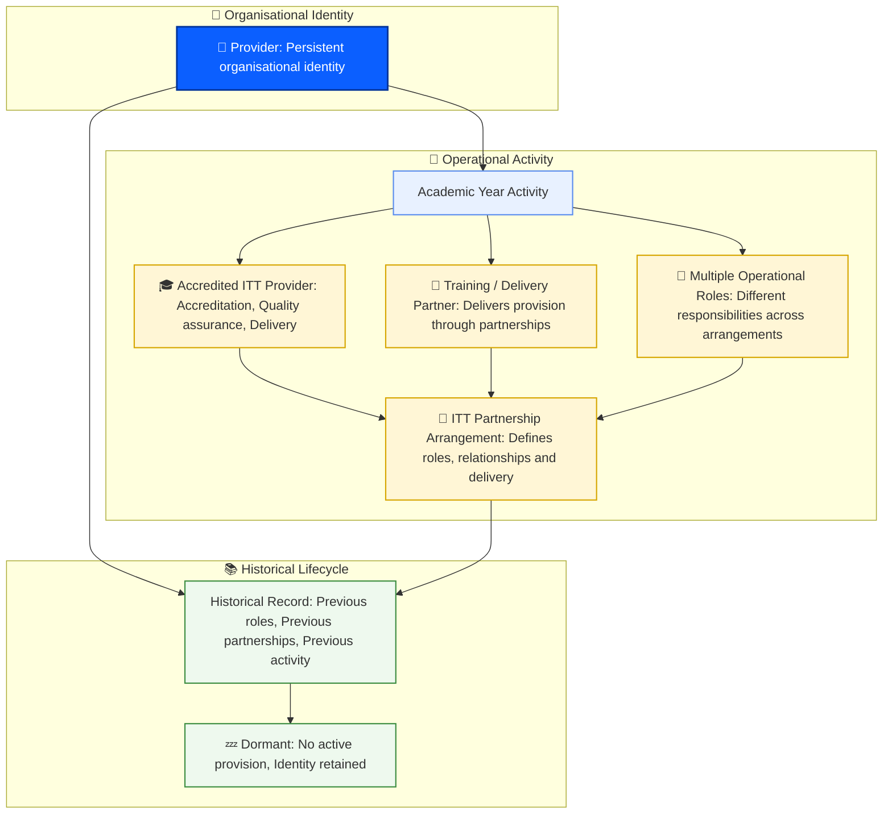

# 10. RoTP identifier

**Date:** 2026-08-05

## Status

**Accepted**

---

## Context

### The problem: provider identity entropy

Provider identity naturally accumulates entropy over time.

Organisations evolve, names change, operational roles shift, partnerships form and dissolve, and different services create their own representations of the same underlying provider.

Without a persistent identity model, this entropy increases through:

- Duplicate provider representations
- Conflicting identifiers
- Inconsistent classifications
- Broken historical relationships
- Disconnected records across services

The absence of a canonical provider identity makes it increasingly difficult to determine whether records represent:

- The same provider at different points in time
- Different providers with similar attributes
- Operational constructs created for administrative purposes
- Historical representations that no longer correspond to current organisational structures

This fragmentation reduces confidence in data quality, reconciliation, auditability, compliance reporting, and longitudinal analysis.

The introduction of RoTP-id applies the principle of **negentropy**: deliberately introducing structure, order, and continuity into a system where information naturally becomes fragmented over time.

RoTP-id provides a stable identity anchor around which provider information can remain connected, consistent, and meaningful throughout the provider lifecycle.

---

## Sources of provider identity entropy

### Naming and Coding Inconsistencies

Providers are represented through multiple identifiers and descriptive attributes, including:

- Operating name
- Legal name
- UKPRN
- Provider code

These values remain valuable for their intended purposes, but they may:

- Change independently over time
- Differ between services
- Represent different views of the same organisation

As a result, they cannot independently provide a reliable identity anchor.

---

### Shifting functional roles

A provider represents a persistent organisational identity, while its functional role within the ITT ecosystem may change over time.

Across different academic years and partnership arrangements, the same provider entity may:

- Act as an accredited ITT provider, holding responsibility for programme design, delivery, and quality assurance
- Act as a training or delivery partner, providing activity on behalf of an accredited provider
- Hold multiple operational roles simultaneously across different delivery arrangements
- Become inactive or dormant while retaining historical records of previous activity

These changes represent changes in operational responsibility, delivery relationships, and participation over time.

They do not necessarily represent the creation of a new provider identity.

The provider entity remains persistent while roles, partnerships, and delivery arrangements evolve.



---

### Organisational complexity and fictional operational entities

Not every operational construct represents an independent provider identity.

Within business processes, services may create records representing:

- Departmental structures
- Administrative divisions
- Delivery arrangements
- Reporting groupings
- Other operational concepts

These constructs may be meaningful for operational management, reporting, or delivery purposes, but they may not represent an organisation with its own independent lifecycle.

This creates an identity ambiguity:

- The construct exists within services and processes
- The construct may require reporting or operational reference
- The construct may not represent an independent organisational entity

Creating provider identities for these constructs increases identity entropy by introducing identifiers that do not correspond to persistent organisational identities.

RoTP-id therefore applies only to persistent provider identities.

Operational, administrative, reporting, or fictional constructs should be represented through relationships, attributes, or contextual records rather than provider identifiers.

---

### Lifecycle state transitions

Providers undergo lifecycle changes including:

- Active operation
- Inactivity
- Reactivation
- Restructuring
- Merger
- Dissolution

These transitions represent changes in organisational circumstances and activity rather than automatically representing the creation of a new provider identity.

Historical records alone may not reliably establish whether a reactivated or restructured provider represents continuity of an existing organisation or the emergence of a new entity.

Changes in:

- Name
- Structure
- Ownership
- Delivery model
- Operational role

can make identity continuity difficult to determine.

A persistent RoTP-id provides the continuity mechanism required to preserve historical meaning and maintain relationships across time.

Organisational events such as mergers, acquisitions, or significant restructuring require explicit identity governance rules to determine whether continuity is maintained or a successor provider identity is created.

---

## Decision

Introduce a persistent, immutable **RoTP-id** assigned to each provider entity at initial registration.

RoTP-id is the canonical identity reference for a provider throughout its organisational lifecycle.

### Identity invariant

A RoTP-id represents one persistent provider identity.

Provider attributes, roles, relationships, and operational states may change over time; the provider identity reference does not.

The RoTP-id remains unchanged regardless of:

- Changes to operating name, legal name, or trading name
- Changes in accreditation status
- Changes in delivery or operational role
- Periods of inactivity or reactivation
- Organisational restructuring

RoTP-id does not represent:

- A regulatory status
- An academic year state
- A provider role
- A temporary operational arrangement
- A reporting classification

These concepts are modelled as attributes, relationships, and lifecycle states associated with the provider identity.

---

## Applied principles

The introduction of RoTP-id follows three core principles.

### Promoting order

RoTP-id introduces a consistent identity structure across services by replacing multiple competing references with a single canonical provider identifier.

This reduces identity entropy by creating a stable reference point for provider information.

---

### Maintaining information integrity

RoTP-id preserves historical continuity by ensuring that changes in names, roles, relationships, or operational states do not break the connection between past and present information.

This supports:

- Accurate audit trails
- Reliable reporting
- Historical analysis
- Compliance evidence

---

### Fostering interconnectedness

RoTP-id provides a shared identity reference across provider-related services.

By connecting accreditation, funding, quality assurance, student, and operational services through a common identity model, information can be reconciled and understood consistently across organisational boundaries.

---

## Format

Format:

```
RoTP-YY[Letter][Number][Letter][Letter]MM
```

Where:

- `RoTP-` = Fixed prefix
- `YY` = Two-digit year of identifier allocation
- `Letter` = A-Z
- `Number` = 0-9
- `Letter` = A-Z
- `Letter` = A-Z
- `MM` = Two-digit month of identifier allocation

Available identifiers per month:

```
26 × 10 × 26 × 26 = 175,760
```

The date component represents the identifier allocation date.

It does not represent:

- Provider creation date
- Accreditation date
- Academic year
- Operational start date

---

## Consequences

### Mandatory adoption

All services that integrate with RoTP must use RoTP-id as the primary provider reference.

Failure to adopt RoTP-id will increase identity entropy through:

- Additional competing identifiers
- Increased reconciliation complexity
- Creation of isolated data silos
- Reduced confidence in historical analysis

---

### Implementation requirements

- Existing provider records must be mapped to RoTP-id during migration
- Existing identifiers such as UKPRN, provider code, and names remain descriptive attributes
- Downstream services must reference RoTP-id when relating information to providers
- Identity governance rules must define when an existing RoTP-id continues and when a new provider identity is created

---

## Benefits

- **Reduced identity entropy** through a persistent canonical reference
- **Improved information integrity** through reliable lifecycle tracking
- **Promoting order** across fragmented provider data
- **Greater interconnectedness** between provider-related services
- **Improved auditability** through consistent historical relationships
- **Higher data quality** through elimination of ambiguous provider references
